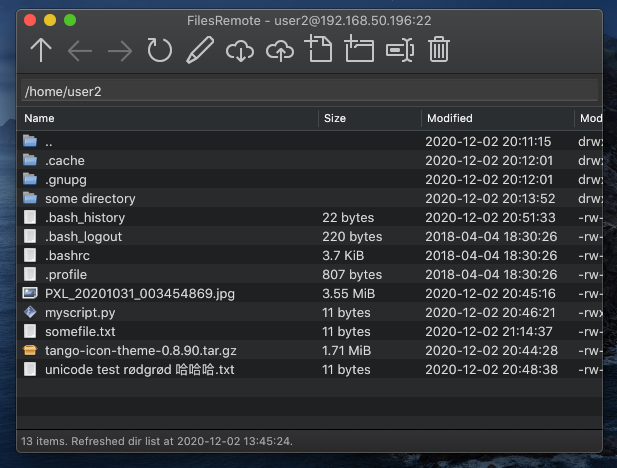

FilesRemote
===========

[Download](https://github.com/allanrbo/FilesRemote/releases/)

An SFTP (SSH) file manager.

 * Edit files like local:
   * Automatically download and open files in a any local editor.
   * Automatically upload when changes are detected.
   * Especially useful on slow and unstable links, where FUSE+SSHFS would cause too big of a slowdown on the local system.
 * Uses SSH auth agent when available, with fallback to password based authentication.
 * Cross platform.

This demo illustrates the automatic upload feature:

macOS:

Windows:

Linux:

Usage
-----

Command line usage: `filesremote [[username@]host[:port]]`.

E.g. `filesremote 192.168.1.60` or `filesremote user1@192.168.1.60:22`. Defaults to your local username and port 22.

### MacOS specific

On first run the app will be blocked, because I do not have an Apple Developer account. Unblock it in this System Preferences pages: 

After starting the app, go to File -> Preferences and set up the path of your text editor. For example for Sublime Text on MacOS this could be:

    open -a "Sublime Text"

Optionally make aliases for easy command line usage:

    alias filesremote="open -a FilesRemote --args $@"
    alias filesremote_myserver="filesremote user1@192.168.1.60"

Development
-----------

### Building the prerequisites

Get and build the 3rd party dependencies:

    # Only on Linux:
        sudo apt install libssl-dev libsecret-1-dev

    # Only on macOS:
        xcode-select --install

        # Manually download and install a CMake binary dmg from cmake.org.
        # After installing CMake from dmg, add it to PATH:
        sudo mkdir -p /usr/local/bin
        sudo /Applications/CMake.app/Contents/bin/cmake-gui --install=/usr/local/bin

    # Only on Windows, using MSYS2 ( C:\msys64\msys2_shell.cmd ):
        pacman -Syy     # Update database cache
        pacman -Syuu    # Upgrade all packages
        pacman -S base-devel
        pacman -S mingw-w64-x86_64-toolchain
        pacman -S cmake
        pacman -S git

        export PATH="/mingw64/bin:$PATH"

    # The following applies generally to all three platforms.

    WORKDIR=$HOME/dev   # or whereever you prefer having your source trees.

    # WxWidgets
    cd $WORKDIR
    curl -L -O https://github.com/wxWidgets/wxWidgets/releases/download/v3.1.4/wxWidgets-3.1.4.tar.bz2
    tar -v -xjf wxWidgets-3.1.4.tar.bz2
    cd wxWidgets-3.1.4/
    ./configure --disable-shared --enable-unicode --without-libjpeg --without-libtiff --with-macosx-version-min=10.13
    # Optional for step-debugging into wxWidgets funcs: --enable-debug
    make -j4

    # OpenSSL
    cd $WORKDIR
    curl -L -O https://www.openssl.org/source/openssl-1.1.1h.tar.gz
    tar -xzf openssl-1.1.1h.tar.gz
    cd openssl-1.1.1h
    if [[ "$OSTYPE" == "darwin"* ]]; then
        export CFLAGS=-mmacosx-version-min=10.13
        export LDFLAGS=-mmacosx-version-min=10.13
    fi
    ./config
    make -j4

    # Libssh2
    cd $WORKDIR
    git clone https://github.com/libssh2/libssh2.git
    cd libssh2
    mkdir mybuild
    cd mybuild
    export CMAKE_PREFIX_PATH="$WORKDIR/openssl-1.1.1h"
    cmake -DCMAKE_OSX_DEPLOYMENT_TARGET=10.13 -DBUILD_EXAMPLES=OFF -DBUILD_TESTING=OFF -DOPENSSL_USE_STATIC_LIBS=TRUE ..
    cmake --build .

### Building FilesRemote

    WORKDIR=$HOME/dev   # or whereever you prefer having your source trees.
    SRCDIR=$WORKDIR/filesremote
    BUILDDIR=$SRCDIR/build$OSTYPE

    # Prepare output directory.
    echo $BUILDDIR
    rm -fr $BUILDDIR ; mkdir -p $BUILDDIR ; cd $BUILDDIR

    # Let CMake know where it can find our 3rd party dependencies.
    export CMAKE_PREFIX_PATH="$WORKDIR/wxWidgets-3.1.4:$WORKDIR/libssh2/mybuild/src:$WORKDIR/openssl-1.1.1h"

    # Special for Windows.
    if [[ "$OSTYPE" == "msys" ]]; then
        export LDFLAGS=-static
        export CMAKE_PREFIX_PATH="$CMAKE_PREFIX_PATH:/mingw64/x86_64-w64-mingw32/lib"
    fi

    # Generate makefiles.
    cmake -DCMAKE_OSX_DEPLOYMENT_TARGET=10.13 -DOPENSSL_USE_STATIC_LIBS=TRUE -DCMAKE_BUILD_TYPE=Release $SRCDIR

    # Build.
    VERBOSE=1 cmake --build .
    cpack -D CPACK_GENERATOR=DEB         # Ubuntu
    cpack -D CPACK_GENERATOR=TGZ         # Ubuntu
    cpack -D CPACK_GENERATOR=DragNDrop   # macOS
    cpack -D CPACK_GENERATOR=ZIP         # Windows

### Troubleshooting build issues

Error "Could NOT find wxWidgets": edit /usr/share/cmake-3.18.4/Modules/FindwxWidgets.cmake to comment in the lines after `macro(DBG_MSG _MSG)`.

MacOS error "Killed: 9" error when starting binary on different machine via a Samba volume: Possibly something with the kernel having cached the binary, and detecting a mismatch. Try reboot, or use a different output binary name.

### Validate that the linking is as you intended (static or dynamic)

    # Linux and Windows+MSYS2
    ldd filesremote
    ldd filesremote.exe

    # macOS
    otool -L filesremote

### Lint

    cpplint --linelength=120 --filter=-whitespace/indent --recursive src/*
